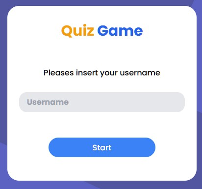

  

<h3 align="center">🐱‍💻Quiz Game🐱‍💻</h3>

---

 Game Quiz about Games, Geography, Mathematics and History
      

## 📝 Table of Contents

- [About](#about)
- [Built Using](#built_using)
- [Acknowledgments](#acknowledgement)

## 🧐 About 

This game is created for practice and to show my knowledge.

## 🔧 Running the tests 

Click in the status under the title

## ⛏️ Built Using 

- [Firebase](https://firebase.google.com/) - Database
- [Tailwind](https://tailwindcss.com/) - CSS Framework
- JavaScript
- HTML
